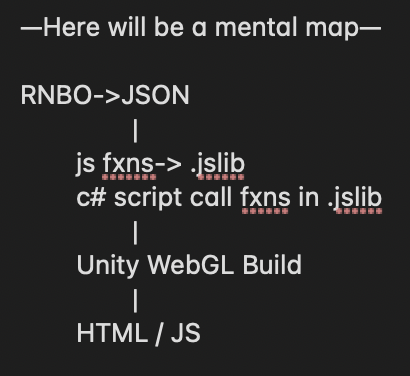

# Using RNBO for generative audio in your Unity WebGL game

I had an idea: a browser-based video game that you can play like a synthesizer: with your movement, items you interact with, and rooms you enter all contributing to the music you make and hear. 

I could start creating the game with Unity, building for its WebGL platform, but I would immediately hit a problem: Unity WebGL builds use a backend for audio based on the Web Audio API that supports only the most basic audio functionality. You can trigger samples, you can have background audio, audio can start and stop, you can play a sample back at a higher or lower pitch, and [that's about it!](https://docs.unity3d.com/Manual/webgl-audio.html)

Even if Unity WebGL allowed for more complex Web Audio API functionality, I'd have to program it myself using JavaScript. Unity's internal audio tools that allow you to mix audio or create adaptive audio using FMOD do not translate to the browser when building for the WebGL platform. In that case, I'd run up against my own limited JavaScript knowledge and the computational limits of using JavaScript for generative audio.

With RNBO, I can patch the generative audio engine of my dreams, and then use that as the audio engine for a Unity WebGL game. I believe this to be extremely exciting due to our ability—especially as Max users who are not necessarily web developers—to create new types of user interfaces for music and audio in the browser, and for sharing musical work in new interactive ways, particularly after a year of Zoom-concert fatigue. 

## To Bridge These Realms

To construct our Bifröst RNBO bridge spanning the patching world of Max, the JavaScript world of our web application, and the world of the Unity Editor, we will need several elements:

- RNBO's JSON export
- a .jslib plug-in file we will create
- a C# script that uses that .jslib plug-in
- a Unity WebGL build
- an index.html file that pulls it all together
- some sort of server

Once our bridge is constructed, we will be able to create browser-based games where player actions and game states can update parameters in our RNBO device, switch between presets, and trigger samples via message events.

In this guide, I've broken the process into 4 phases based on the different types of programming needed.

## Phase 0: Tips to avoid pain

- be testing on https, due to audio in the browser and also TLS issues
- make sure to include an opt-in from the user to audio in your javascript, or browsers like chrome won't let your audio start
- if you are using a local testing server, you might have issues with its configuration (especially with compressed js files using gzip)
- i'm using Unity 2020.3.x
- don't use .aif, chrome won't be happy. use .wav or .mp3

## Phase I: RNBO phase

RNBO -> JSON export
- include presets if you are going to use them
- include samples if you are going to use them

## Phase II: Javascript/C# phase

- set up a js file (or include as a script in index.html) that creates the RNBO device and audioContext

Javascript -> .jslib file
- get any js function that you need to call from unity into this plugin format

C# scripts that call the .jslib functions import use DLL etc 

## Phase III: Unity Phase

Unity -> WebGL build (with compression disabled? I'll confirm this)

## Phase IV: HTML phase

index.html generated by the WebGL build
- needs link to @rnbo/js script [digital ocean spaces or npm install]
- needs Build (and TemplateData potentially) folders and the correct unity build files linked
- needs your javascript, with the functions that have been called in C# with .jslib's help
- serve it all up

Now you are connected!

## part 2: samples and presets

- samples: use message events, triggered by collision for example to trigger samples

- presets: can use game state or collision, for example, to set preset 