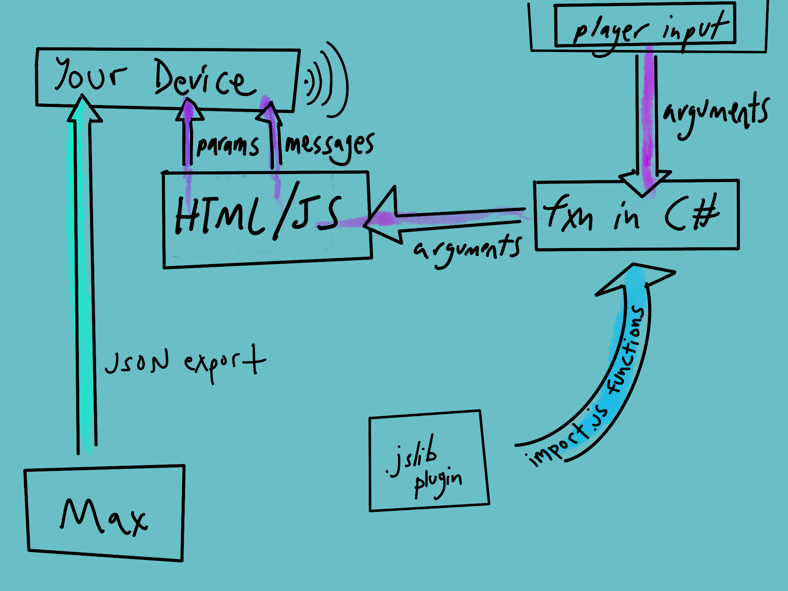
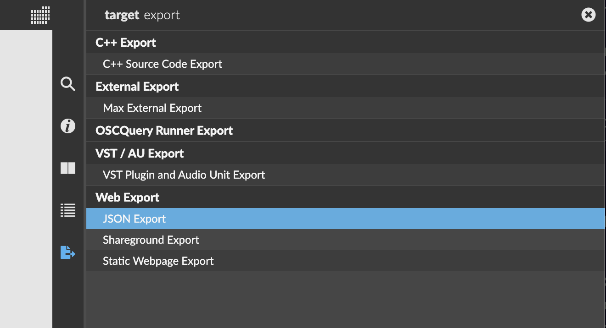
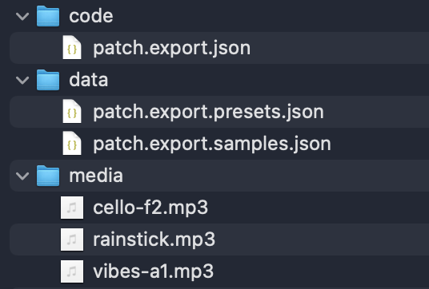
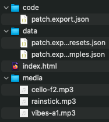
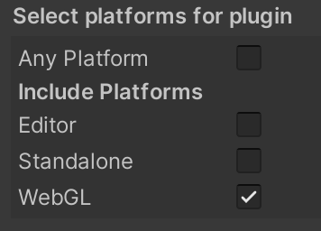
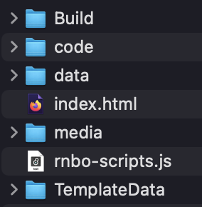

# Using RNBO for generative audio in your Unity WebGL game

Hello friends, I'm Alex, a Max user, composer, laptop performer, generative video artist. What I am *not*, is a web developer. This tutorial is, in part, a story of how RNBO has made that world accessible to me and how it allows me to make art in the browser in a way that would not have been possible before.

I had an idea: a browser-based video game that you can play like a synthesizer: with your movement, items you interact with, and rooms you enter all contributing to the music you make and hear. 

I could start creating the game with Unity, building for its WebGL platform, but I would immediately hit a problem: Unity WebGL builds use a backend for audio based on the Web Audio API that supports only the most basic audio functionality. You can trigger samples, you can have background audio, audio can start and stop, you can play a sample back at a higher or lower pitch, and [that's about it!](https://docs.unity3d.com/Manual/webgl-audio.html)

Even if Unity WebGL allowed for more complex Web Audio API functionality, I'd have to program it myself using JavaScript. Unity's internal audio tools that allow you to mix audio or create adaptive audio using FMOD do not translate to the browser when building for the WebGL platform. In that case, I'd run up against my own limited JavaScript knowledge and the computational limits of using JavaScript for generative audio.

With RNBO, I can patch the generative audio engine of my dreams, and then use that as the audio engine for a Unity WebGL game. I believe this to be extremely exciting due to our ability—especially for Max users who are not necessarily web developers—to create new types of user interfaces for music and audio in the browser, and for sharing musical work in new interactive ways, particularly after a year of Zoom-concert fatigue. 



## To Bridge These Realms

To construct our Bifröst RNBO bridge spanning the patching world of Max, the JavaScript world of our web application, and the world of the Unity Editor, we will need several elements:

- RNBO's JSON export
- a .jslib plug-in file we will create
- a C# script that uses that .jslib plug-in
- a Unity WebGL build
- an index.html file that pulls it all together
- some sort of server

Once our bridge is constructed, we will be able to create browser-based games where player actions and game states can update parameters in our RNBO device, switch between presets, and trigger samples via message events.

In this guide, I've broken the process into 4 phases based on the different types of programming needed.


## Phase 0: Tips to avoid pain

I am new to web development. As I began this project, I experienced some pain. Please learn from my pain and follow these tips. I'll include a longer discussion of these pain-avoidance methods at the end of this tutorial, but to summarize:

- Test on HTTPS
- Make sure your local testing server is configured for compressed .js files
- Inlude an Opt-in from user for browser audio
- Use `.wav` or `.mp3` rather than `.aif`


## Phase I: RNBO phase

So you've built your RNBO device, the engine for your cool generative audio video game. In the simple example patch included with this tutorial, you can see a `[rnbo~]` with parameters, an inport for receiving messages, and several `[buffer~]` objects within RNBO that hold our samples. You can learn more about communications in and out of your RNBO device [in the documentation](https://rnbo.cycling74.com/docs/rnbo_communications_topic?v=).

If you unlock the patcher, select the `[rnbo~]` object, and look at the object snapshots, you'll see that there are three snapshots with filled-in circles indicating that these snapshots are saved with the device. These snapshots will become our presets when we export the device.
<<<<<<< HEAD:tutorial.md


The first key to the RNBO-Unity WebGL connection is to export your RNBO patch with the JSON Export target. 



In "Configuration," if you are using presets and samples, make sure to check the box for "Include Presets" and "Generate Sample Dependencies File." If you select "Copy Sample Dependencies," the export will generate a handy `/media` directory filled with all of your samples. 


=======

The first key to the RNBO-Unity WebGL connection is to export your RNBO patch with the JSON Export target. 

In "Configuration," if you are using presets and samples, make sure to check the box for "Include Presets" and "Generate Sample Dependencies File." If you select "Copy Sample Dependencies," the export will generate a handy `/media` directory filled with all of your samples. 

>>>>>>> dev:tutorial-pt-1.md
I will urge you here to make sure that your samples are in the `.wav` or `.mp3` format rather than `.aif`, as Chrome and other browsers might reject the `.aif` files. 

You also want to have "Codegen: Generate WASM Output" selected, as this can greatly improve the device's performance in the browser.

When you are ready to export the device, it's preset dependencies, and sample depencies, select an Output Directory and Export to Selected Target.
<<<<<<< HEAD:tutorial.md


You should now have, in your chosen directory, a `/code` folder containing your patch as a `.json` file, a `/data` folder containing your preset and sample data, also as `.json` files, and a `/media` folder full of the samples themselves.


=======


You should now have, in your chosen directory, a `/code` folder containing your patch as a `.json` file, a `/data` folder containing your preset and sample data, also as `.json` files, and a `/media` folder full of the samples themselves.

>>>>>>> dev:tutorial-pt-1.md

We will need all of these files and folders when we are building our web application. 

## Phase II: Javascript phase

### Key Javascript code

Much of the information in the [Using RNBO in a Web Application](https://rnbo.cycling74.com/docs/rnbo_using_rnbo_web_app?v=) tutorial is going to be applicable for our project, as we essentially want to get our RNBO device working in the browser and then connect it to the data coming from our Unity game. For this reason, I also found it helpful to test my device's functionality with the [Static Webpage Export](https://rnbo.cycling74.com/docs/rnbo_web_export_scaffold?v=) and/or the [Shareground](https://rnbo.cycling74.com/docs/rnbo_shareground?v=) just to make sure the parameters, presets, and samples were behaving as expected.

As the Web App tutorial describes, we will need the RNBO Javascript library in order to load our patcher. The simplest way to do this is to include a HTML script tag in your `index.html` file:

```html
<script type="text/javascript" src="https://c74-public.nyc3.digitaloceanspaces.com/rnbo/0.10.0/rnbo.min.js"></script>
```
This `index.html` file should be in the root directory of your web application:
<<<<<<< HEAD:tutorial.md


=======

>>>>>>> dev:tutorial-pt-1.md

With this library, you can now fetch your local patch JSON and load it into a RNBO device that you create. You can do that with code like the following, either inside of a `<script>` tag or its own `.js` file.

```js
let WAContext = window.AudioContext || window.webkitAudioContext;
let context = new WAContext();

// Create gain node and connect it to audio output
let outputNode = context.createGain();
outputNode.connect(context.destination);

let patcher;

fetch("patch.export.json")
  .then((response) => response.json())

  // Use the fetched patcher to create a RNBO device
  .then((responseJson) => {
    patcher = responseJson;
    return RNBO.createDevice({
      context,
      patcher
    });
  })

  .then((device) => {
    // When the device is ready, connect it to audio output
    device.node.connect(outputNode);
  })
  .catch((err) => {
    console.error(err)
  });
```


### Creating a JavaScript Library plugin for Unity

As one of the primary ways we interact with our RNBO device is by updating a parameter, let's start by exploring together how to update a parameter using data we get from the game player's interaction with our Unity game.

For example, what if we want one of the frequencies in a simple FM patch to be generated by the player's movement through the game environment?

Let's call that frequency parameter `"modTwo"`, and let's say that the player's location along the horizontal axis, a `float` value, will drive this parameter.

We need a process that works like this:

- player moves in a horizontal direction
- a value representing that horizontal location is sent to our RNBO device
- that value updates the parameter "modTwo"

We can do that with three elements:

1. define a **function in our javascript** that takes a parameter and a float as arguments, then sets the value of that parameter with that float
2. **create a plugin** containing a *second* function we can use in our C# script to pass the data we need to the javascript function
3. **import the function** into a C# script that will use that function and pass it a string, `"modTwo"` and a float, the horizontal location value.

Our Javascript function could look something like:

```js
function updateParamWithFloat(paramName, float) {
    let param = myDevice.parametersById.get(paramName);
    let val = Math.abs(float);
    if (param) param.value = val;
}
```
*Note, the above code assumes that `myDevice` has been assigned the value of `device`, our RNBO device, at some point, an example of which you can see in the `rnbo-scripts.js` file accompanying this tutorial.*

This `updateParamWithFloat()` function should recieve a string and a float, it will look for a parameter in our RNBO device that has a name matching that string, it will take the absolute value of the float (to avoid negative values, since this is a frequency), and, if that parameter does indeed exist, it will set that parameter's value accordingly.

Now, we need to create a `.jslib` file, a special plugin file that Unity uses to assist in interacting with browser scripting, specifically Javascript. I call mine `jsLibrary.jslib`, and I will treat it as a library with any javascript functions that I need to call in my C# scripts.

In that plugin, we'll define a new function with the following syntax:

```
mergeInto(LibraryManager.library, {
  
  setParamWithFloat: function(paramName, value) {
    var param = UTF8ToString(paramName);
    updateParamWithFloat(param, value);
  },

});
```

You can see that this function, `setParamWithFloat()` will take as arguments a parameter name and a value, and pass those arguments to the function we've already defined, `updateParamWithFloat()`.

There are some restrictions on how you can pass data types—simple numeric types (like integer or float) can be passed to our Javascript without conversion, but strings are a bit more complicated. We need some way to allocate memory for this and write a string to that memory. Thankfully, there are some helper functions that will help with this process, different ones that you can use depending on whether or not the string is a return value. 

My solution, using the `UTF8ToString()` helper function above, works fine for this particular situation. For more information, I'll point you to [this page](https://docs.unity3d.com/Manual/webgl-interactingwithbrowserscripting.html) of the Unity documentation.


## Phase III: Unity Phase

Now, we move over into our Unity project. Navigate to the Project window, and under "Assets," create a new folder called "Plugins" if you do not already have a Plugins folder. 


Here is where you should put your `jsLibrary.jslib` file. Once it is in the Plugins folder, click on your `.jslib` file,  open it in the Inspector, and make sure that WebGL is selected as the plugin's platform.



Now we need to import the function from our `.jslib` plugin into our C# script.

I'll use my `PlayerController.cs` script as an example, you can look at the full script [here](https://github.com/jinpavg/simpleComms-game/blob/fc41782169a448598b6d01f4e70e7a69c556e949/Assets/Scripts/PlayerController.cs). 

First, we need to add this line:

```c#
using System.Runtime.InteropServices;
```
Which gives us the `DllImportAttribute`, which we need to call our function. We then import the specific function inside the class body, in this example, of the `PlayerController` class.

```c#
[DllImport("__Internal")]
private static extern void setParamWithFloat(string paramName, float value);
```
Please note, as I did not, that `"__Internal"` contains **two** underscores in a row. The import will not work without both underscores.

Later, for example in `Update()`, we can call our `setParamWithFloat()` function.

Let's look at this all together.

```c#
using System.Collections;
using System.Collections.Generic;
using System.Runtime.InteropServices;
using UnityEngine;

public class PlayerController : MonoBehaviour
{
    [DllImport("__Internal")]
    private static extern void setParamWithFloat(string paramName, float value);

    public float horizontalInput;
    public float speed = 10.0f;
    private float horizLoc;

    // Update is called once per frame
    void Update()
    {
        //move character left and right
        horizontalInput = Input.GetAxis("Horizontal");
        transform.Translate(Vector3.right * horizontalInput * Time.deltaTime * speed);

        // send horizontal position to js
        horizLoc = transform.position.x;
        setParamWithFloat("modTwo", horizLoc);
    }
}

```
So now, if all goes according to plan, we will have passed the string `"modTwo"` and the value of `horizLoc` to `setParamWithFloat()`, which will convert that string to a string that our Javascript can use and pass that converted string and the value of `horizLoc` to `updateParamWithFloat()`, over in our our Javascript file. Then, `updateParamWithFloat()` will look for a parameter in our device whose name matches that string, and, if it exists, will set its value to the absolute value of `horizLoc`. **Whew!** What a journey.


### Building our Game

Now, assuming that our C# scripts are components of their appropriate Game Objects (my `PlayerController` script is a component of my "player" ball), we just need to Build for the WebGL platform. 

In "Build Settings," check the scene(s) you want to include in the build, select "WebGL" and click "Switch Platform" if WebGL is not your current platform. 

Next, click "Player Settings," scroll down to "Publishing Settings," and turn the Compression Format to "Disabled." This is obviously not ideal for larger game builds, but this tutorial will only work with this setting due to an active [Unity bug](https://forum.unity.com/threads/uncaught-referenceerror-unityframework-is-not-defined-at-htmlscriptelement-script-onload-webgl.803967/) at its time of writing.


With that, select "Build" and choose an empty folder to house the build.

## Phase IV: HTML phase

The WebGL build will generate an `index.html` file, a `/Build` directory, and a `/TemplateData` directory. Both these directories contain scripts that are referenced by this `index.html` file, and you will need them to load and play your Unity WebGL game.

Now your web app's root directory might look somethign like this:



Depending on how you are integrating your Unity game into your web app, you may want to take this from the `index.html` file generated by Unity:

```html
  <!-- Unity WebGL page content -->
  <div id="unity-container" class="unity-desktop">
    <canvas id="unity-canvas"></canvas>
    <div id="unity-loading-bar">
      <div id="unity-logo"></div>
      <div id="unity-progress-bar-empty">
        <div id="unity-progress-bar-full"></div>
      </div>
    </div>
    <div id="unity-mobile-warning">
      WebGL builds are not supported on mobile devices.
    </div>
    <div id="unity-footer">
      <div id="unity-webgl-logo"></div>
      <div id="unity-fullscreen-button"></div>
      <div id="unity-build-title">simpleComms</div>
    </div>
  </div>
```
You will also need the following `<script>` tag, in order to load the files from `/Build` and `/TemplateData` folders. In my example, I built my WebGL game into a folder titled "connectItToUnity2," and the build files are titled accordingly.

```html
<!-- Unity WebGL Build -->
  <script>
    var buildUrl = "Build";
    var loaderUrl = buildUrl + "/connectItUnity2.loader.js";
    var config = {
      dataUrl: buildUrl + "/connectItUnity2.data",
      frameworkUrl: buildUrl + "/connectItUnity2.framework.js",
      codeUrl: buildUrl + "/connectItUnity2.wasm",
      streamingAssetsUrl: "StreamingAssets",
      companyName: "DefaultCompany",
      productName: "simpleComms",
      productVersion: "0.1",
    };

    var container = document.querySelector("#unity-container");
    var canvas = document.querySelector("#unity-canvas");
    var loadingBar = document.querySelector("#unity-loading-bar");
    var progressBarFull = document.querySelector("#unity-progress-bar-full");
    var fullscreenButton = document.querySelector("#unity-fullscreen-button");
    var mobileWarning = document.querySelector("#unity-mobile-warning");

    if (/iPhone|iPad|iPod|Android/i.test(navigator.userAgent)) {
      container.className = "unity-mobile";
      config.devicePixelRatio = 1;
      mobileWarning.style.display = "block";
      setTimeout(() => {
        mobileWarning.style.display = "none";
      }, 5000);
    } else {
      canvas.style.width = "960px";
      canvas.style.height = "600px";
    }
    loadingBar.style.display = "block";

    var script = document.createElement("script");
    script.src = loaderUrl;
    script.onload = () => {
      createUnityInstance(canvas, config, (progress) => {
        progressBarFull.style.width = 100 * progress + "%";
      }).then((unityInstance) => {
        loadingBar.style.display = "none";
        fullscreenButton.onclick = () => {
          unityInstance.SetFullscreen(1);
        };
      }).catch((message) => {
        alert(message);
      });
    };
    document.body.appendChild(script);
  </script>
```

Again, you may not need all of the above, depending on how you are configuring your Unity game. This is simply the most standard configuration.

### You Made It

You've made it. Serve up that web app with your secure connection, click somewhere on the page to trigger your `AudioContext.resume()`, and use the left and right arrow keys to change your modulation parameter. You've got generative audio in a Unity WebGL game!

*See Appendix II to change presets and send messages to your RNBO device to trigger samples in-game.*

## Appendix I: Tips to avoid pain (verbose)

### Test on HTTPS

In order to build and test your web application, you will need to run a simple, local HTTP Server that can serve the static files. The best way to do that might depend on your system but two options are

- Python's built-in simple HTTPServer, see this [MDN Guide](https://developer.mozilla.org/en-US/docs/Learn/Common_questions/set_up_a_local_testing_server)
- The http-server package available [via NPM](https://www.npmjs.com/package/http-server)

Now, the painful part: you may run into issues if you aren't using HTTPS. For example, if you try to access the web page on another machine (like a second computer in your office), your RNBO device may not run at all. In fact, many browsers have safeguards that stop audio processing from working as you might expect if the connection is not secure.

So for this reason, you'll want to test on a secure connection. For example, if you are using the `http-server` package, you could follow [these instructions](https://www.npmjs.com/package/http-server#tlsssl).

### Make sure your local testing server is configured for compressed .js files

If you are using a local testing server, you might have issues with its configuration (especially with compressed js files using gzip or brotli). For this, you'll want to search for the way to configure your server to serve up these compressed files. For example, with `http-server` you could use these ["available options"](https://www.npmjs.com/package/http-server#available-options).

### Opt-in from user for browser audio

Make sure to include an opt-in from the user to audio in your javascript, or browsers like chrome won't let your audio start. This generally means including

```js
AudioContext.resume()
```
somewhere in an element that a user will click on. For example, I have an on/off button and instructions for the user to begin by clicking this button. 

```js
function startStop() {
    // resume audio context on user activity, makes browser happy
    context.resume().then(() => {
        console.log('Playback resumed successfully');
    });
    if (openingParam.value === 1) {
        openingParam.value = 0
    } else {
        openingParam.value = 1
    }
}
```

### Chrome doesn't like your `.aif` files

If you are copying sample dependencies in your RNBO export, make sure to use `.wav` or `.mp3` files rather than `.aif`. 

### Unity version

And finally, as a word of caution, I'm using Unity 2020.3.x for the purposes of this tutorial. [Many things have changed](https://forum.unity.com/threads/changes-to-the-webgl-loader-and-templates-introduced-in-unity-2020-1.817698/) between 2018 and 2021 in terms of how Unity exports and compresses code for its WebGL builds. Some of what I describe in this tutorial may not work with a Unity 2018.xx version, or might require adjustment. In addition, there are some active Unity bugs regarding compression of WebGL Build files that may be fixed after the writing of this tutorial.

<<<<<<< HEAD:tutorial.md
- samples: use message events, triggered by collision, for example, to trigger samples
=======
## Appendix II: Samples and Presets
>>>>>>> dev:tutorial-pt-1.md

# Using RNBO for generative audio in your Unity WebGL game

## Part 2: Samples and Presets

In our generative game audio design journey, we will likely want to trigger samples or perhaps switch between several of our RNBO device presets based on game state.

Our communication between our Unity C# scripting and our Javascript will work in much the same way as updating parameters, though we will have to set our Javascript up to load presets and samples, and set up a function that sends our RNBO device a message, rather than a parameter update.

## Set up our Javascript

If we want to load presets and samples, we'll need to initialize

```js
let presets = [];
let samples = [];
```
We'll also want to add, after we fetch our `patch.export.json`:

```js
// Load and parse the presets file
.then(() => {
    return fetch("data/patch.export.presets.json")
})

.then((presetsResponse) => {
    return presetsResponse.json()
})

.then((presetsJson) => {
    presets = presetsJson;
})

// Load and parse the samples file
.then(() => {
    return fetch("data/patch.export.samples.json")
})

.then((samplesResponse) => {
    return samplesResponse.json()
})

.then((samplesJson) => {
    samples = samplesJson;
})
```
and also, after we've connected our device to audio output:

```js
.then((device) => {
    // when device is ready, connect it to audio output
    device.node.connect(outputNode);

    // If there are any samples to load, load them
    let loadSample = (path, sampleid, device, audioContext) => {
        return fetch(path)
        .then((fileResponse) => {
            if (fileResponse.ok)
                return fileResponse.arrayBuffer();

            throw new Error("Couldn't find sample file at path " + path);
        })
        .then((arrayBuffer) => {
            return new Promise((resolve, reject) => {
                audioContext.decodeAudioData(arrayBuffer, (buf) => resolve(buf), (err) => reject(err));
            });
        })
        .then((decodedAudio) => {
            return device.setDataBuffer(sampleid, decodedAudio);
        })
        .catch((err) => {
            console.log("Couldn't load buffer with name " + sampleid);
            console.error(err);
        });
    }

    samples.forEach((sample) => {
        // Samples paths are relative to the samples.json file
        let samplePath = "data/" + sample.path;

        // This is an asynchronous function, but we call it without waiting for the result
        loadSample(samplePath, sample.name, device, audioContext);
    });


})
```
To see this all in one place, you can look in the example file associated with this tutorial, `rnbo-scripts.js`.

## It's about sending a message

To illustrate how we could send a message to trigger a sample, imagine this simple inport which just takes in one of three integers and triggers one of three samples.

In Max:


In rnbo~:


To facillitate picking this sample from our Unity game, we'll first set up a function in our `.jslib` file which will pass a single value, which we will use as the index of our `samples` array.

```
  pickSampleFromUnity: function(x) {
    useSampleFromUnity(x);
  },
```
Then, in our C# script, we will import that function:

```c#
[DllImport("__Internal")]
private static extern void pickSampleFromUnity(int x);   
```
And later, pass it an integer which will serve as the index of our `samples` array. I'll call it `sampleIndex`. In my example, I'm passing it a random integer between 0 and 2 on every collision between the player and a target.

```c#
int sampleIndex = Random.Range(0, 3);
pickSampleFromUnity(sampleIndex);
```

and in our javascript, we'll define that `useSampleFromUnity()` function.

```js
function useSampleFromUnity(sampleIndex){
    if (myDevice) {
        let messageBody = [sampleIndex];
        let messageEvent = new RNBO.MessageEvent(RNBO.TimeNow, "thisSample", messageBody);
        myDevice.scheduleEvent(messageEvent);
    }
}
```
*Note: the line `let messageBody = [sampleIndex]` contains an array so that we have the ability to send multiple integers to our device in this message if we want to do that. In this example, we're only sending one at a time. Also, please see the earlier note regarding the variable `myDevice`.*

### Picking a preset

If we want to pick a preset, we just use that integer that we sent from Unity slightly differently. Instead of sending a message, we can set the preset using the following code.

```js
// here, the "0" sets the first preset
device.setPreset(
        presets[0].preset
      )
```